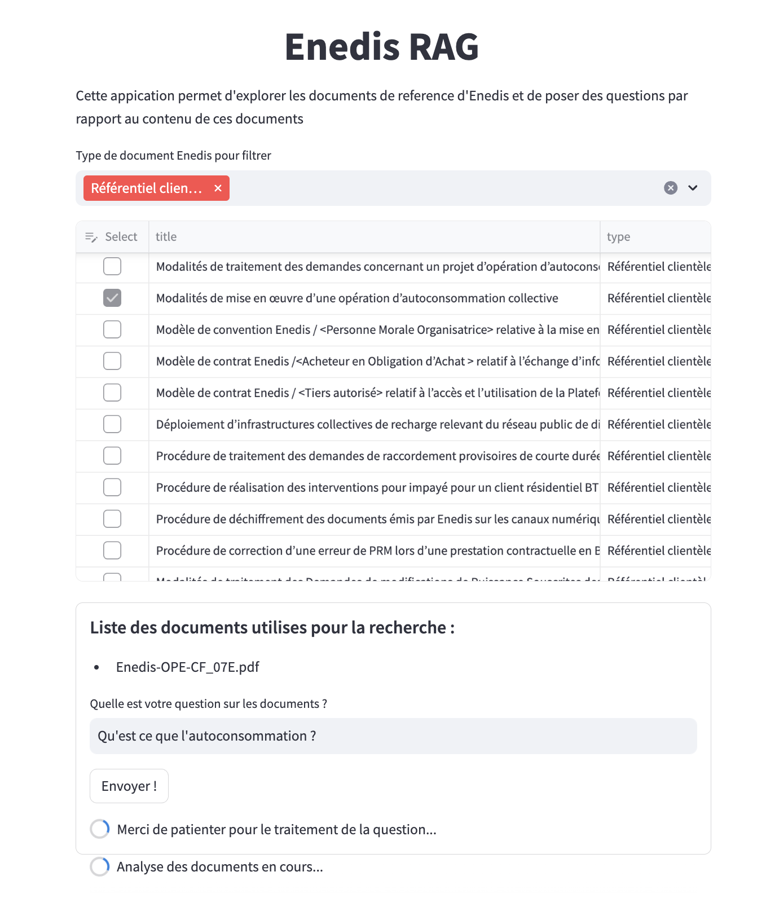
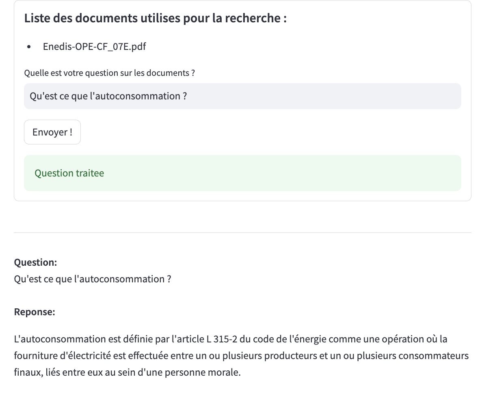
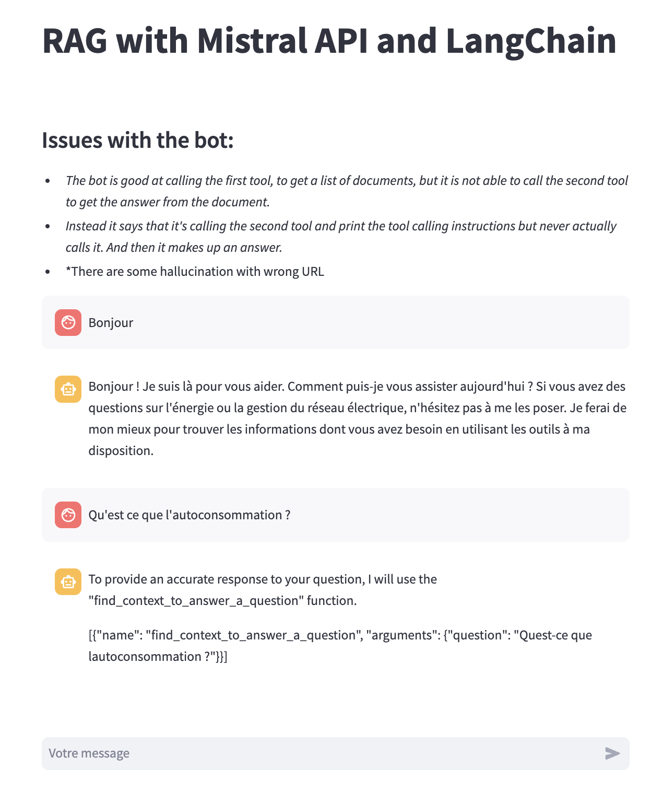
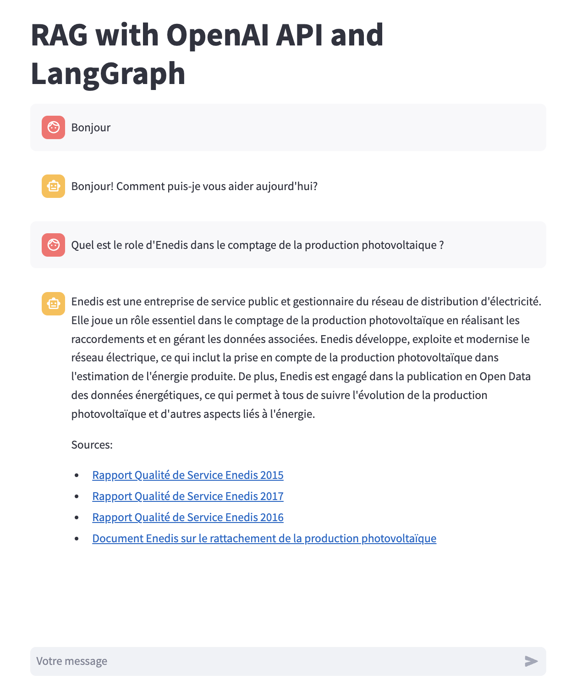

# RAG Enedis

This project is an exploration of LLM, RAG, LangChain and LangGraph. 

## Run the program 
```
make install && make run_app
```

## Data :
Enedis, the french DSO has a document library available online where they put all of their public pdf document : https://www.enedis.fr/documents. This website is interesting but I wanted to make the information it contains easier to access.

## Scrapping of the Enedis Document website
I created a program that scrap the Enedis document website and create a csv file that looks like that: 

title | url | type | date | content | file_name | file_type | file_size 
--- | --- | --- | --- |--- |--- |--- |--- 
Mise en œuvre de la généralisation [...]  compteur communicant | https://www.enedis.fr/media/4107/download | Référentiel clientèle | 2024-05-21T09:03:25+02:00 | Suite à la délibération de la CRE [...] mise en œuvre de la généralisation de l'option tarifaire à 4 plages temporelles. | Enedis-NMO-CF_007E.pdf | fichier PDF | 1.45 Mo 


## RAG with HuggingFace and LangChain

*Select a document and ask a question*
<div align="center">

</div>

*Get your answer !*
<div align="center">

</div>

### What the program does
- Download the file
- Transform the pdf file into a FAISS vector database. 
- Transform the question into a vector and does a similarity search with the database. 
- Create a RAG LangChain with a specific prompt template (see in config/CFG.py)
- Send the request to the Mistral / HuggingFace API
- Show the result

## RAG Chatbot with Mistral API and LangChain
<div align="center">

</div>
I used the mistral API to call the Mistral-large model. I implemented a LangChain RAG giving the model the possibility to call a function to get some information. 

### Issues with the model
Quite often, the model tells me that it got information from the tools which is not true. It made up a response based on it's own knowledge... This is quite annoying for a RAG...

## RAG Chatbot with OpenAI and LangGraph
<div align="center">

</div>
I used the OpenAI model (gpt 3,5 turbo). I implemented a LangGraph RAG giving the model the possibility to call a function to get some information. 
The model seems to be working a lot better than Mistral. It never gives me an answer without first calling a tool and citing its sources. 

### Features that will be implemented soon
I will implement new functions that can be called by the models : 
- Send an email to the user with a summary of the conversation
- Create a summary of an Enedis PDF Document
- Search for client information in a database
- Save the conversation in a database for use later.